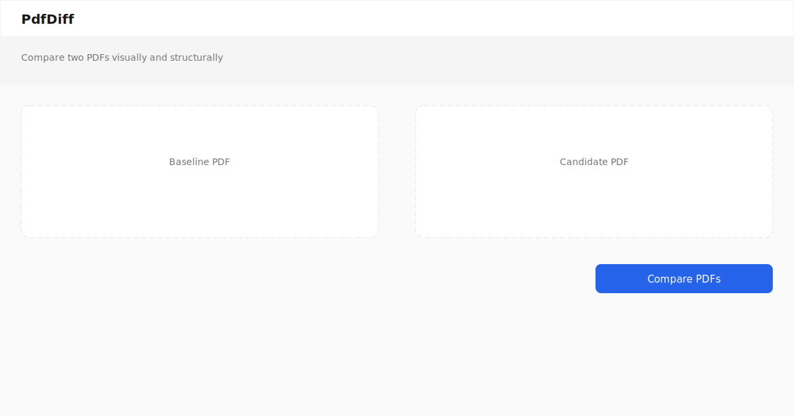

# PdfDiff — PDF Visual Diff Online

Compare PDFs visually and structurally online — per-page masks, text and object diffs, signature checks, and human-readable summaries.



## Topics

`pdf`, `pdf-diff`, `pdf-compare`, `visual-diff`, `visual-regression`, `pdf-tools`, `document-comparison`, `pymupdf`, `pdf-text-diff`, `signed-pdf`, `pdf-annotations`, `pdf-forms`, `document-automation`, `online-tool`

## Features

| PRD | Feature |
|-----|---------|
| F1 | Visual diff — DPI, pixel masks (`pixelmatch`), tolerance, overlay with bounding boxes |
| F2 | Position-aware text diff |
| F3 | Annotations, form fields, attachments, bookmarks, signatures |
| F4 | Metadata + XMP diff |
| F5 | Embedded fonts and images |
| F6 | Plain-English summary |
| F7 | ZIP bundle — masks, composite PDF, summary HTML/JSON |
| F8 | CI assert mode (pass/fail threshold) |
| F9 | Pro baselines API (`BASELINES_DIR` on worker) |

## Quick start

### Docker (recommended)

```bash
cp .env.example .env
docker compose up --build
```

- Web: http://localhost:3000  
- Worker health: http://localhost:8000/health  

### Local development

```bash
cp .env.example .env
pnpm install
pnpm --filter @pdf-diff/shared-types build

# Terminal 1 — worker
cd apps/worker && pip install -r requirements.txt
PYTHONPATH=. uvicorn app.main:app --reload --port 8000

# Terminal 2 — web
pnpm --filter @pdf-diff/web dev
```

## API

| Endpoint | Description |
|----------|-------------|
| `GET /health` | Health check + stale job cleanup |
| `POST /v1/diff` | Compare PDFs |
| `POST /v1/assert` | Compare + pass/fail vs threshold |
| `POST /v1/baselines` | Save baseline (Pro, needs `BASELINES_DIR`) |
| `GET /v1/baselines/{repo}/{branch}` | Fetch stored baseline |
| `GET /v1/artifacts/{jobId}/{file}` | Download mask/bundle |

Multipart fields: `baseline`, `candidate`, `dpi`, `tolerance`, optional `baseline_password`, `candidate_password`. Assert adds `threshold`.

## Testing

```bash
# Worker unit + acceptance tests
cd apps/worker && PYTHONPATH=. pytest -q -m "not slow"

# Performance budget (optional)
cd apps/worker && PYTHONPATH=. pytest -q -m slow

# Web
pnpm --filter @pdf-diff/web typecheck
pnpm --filter @pdf-diff/web lint
pnpm --filter @pdf-diff/web build

# E2E (worker + web must be running, or use CI)
pnpm --filter @pdf-diff/web test:e2e
```

## Samples

```bash
python3 scripts/generate_samples.py
```

Includes contract drift, report drift, layout change, and **signature-removed** fixtures (`signed-baseline.pdf` vs `signed-candidate-unsigned.pdf`).

## Environment

See [.env.example](.env.example).

## SEO routes

`/pdf-compare`, `/pdf-visual-diff`, `/pdf-text-diff`, `/pdf-signature-check`, `/pdf-regression-test` — each exposes the playground with route-specific copy.

## Legal

| Document | Location |
|----------|----------|
| Terms of Service | [legal/terms.md](legal/terms.md) (web: `/terms`) |
| Privacy Policy | [legal/privacy.md](legal/privacy.md) |
| Disclaimer | [legal/disclaimer.md](legal/disclaimer.md) |
| Software license | [LICENSE](LICENSE) (GNU **AGPL-3.0**) |

Hosted use is subject to Terms and Privacy. Software is provided **without warranty** under the AGPL. Output is **not** legal or compliance advice.

## License

GNU Affero General Public License v3.0 — see [LICENSE](LICENSE) and https://www.gnu.org/licenses/agpl-3.0.html.

## Links

- [GitHub](https://github.com/chayprabs/pdf-visual-diff-online)
- [Security](SECURITY.md) · [security.txt](security.txt)
